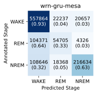
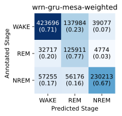

(classification)=
# Classification

## Included classifiers
SleepECG contains classifiers trained on large open sleep datasets.
Note that the performance metrics are averages, so a classifier might perform much better or much worse for an individual record.

|Identifier|Stages|Model|Training set (nights)|Test set (nights)|Acc|κ|Source|
|-|-|-|-|-|-|-|-|
|`ws-gru-mesa`|WAKE-SLEEP|[GRU](https://en.wikipedia.org/wiki/Gated_recurrent_unit)|MESA (1971)|SHHS (1000)|0.83|0.60|[Link](https://github.com/cbrnr/sleepecg/blob/main/examples/classifiers/ws_gru_mesa.py)|
|`wrn-gru-mesa`|WAKE-REM-NREM|[GRU](https://en.wikipedia.org/wiki/Gated_recurrent_unit)|MESA (1971)|SHHS (1000)|0.75|0.54|[Link](https://github.com/cbrnr/sleepecg/blob/main/examples/classifiers/wrn_gru_mesa.py)|
|`wrn-gru-mesa-weighted`|WAKE-REM-NREM|[GRU](https://en.wikipedia.org/wiki/Gated_recurrent_unit)|MESA (1971)|SHHS (1000)|0.70|0.53|[Link](https://github.com/cbrnr/sleepecg/blob/main/examples/classifiers/wrn_gru_mesa_weighted.py)|

As REM is much less common than NREM and WAKE, the current models show limited performance in WAKE-REM-NREM classification.
Using no sample weights, the `wrn-gru-mesa` model identifies 64% of actual REM stages as NREM as shown in the confusion matrix below (left).
With sample weights inversely proportional to class frequency in `wrn-gru-mesa-weighted`, the confusion matrix (right) is more symmetrical.
While the values normalized over true classes (given in parentheses) look promising, the number of actual NREM stages identified as REM is larger than the number of correctly identified REM stages (i.e. the model has low precision for REM).
A weaker weighting approach is likely required to find the optimal middle ground.

&nbsp;&nbsp;&nbsp;&nbsp;&nbsp;

## Usage examples
|File|Description|
|-|-|
|[`try_ws_gru_mesa.py`](https://github.com/cbrnr/sleepecg/blob/main/examples/try_ws_gru_mesa.py)|This example demonstrates how to use the WAKE-SLEEP classifier `ws-gru-mesa`, a GRU-based classifier bundled with SleepECG which was trained on 1971 nights of the [MESA](https://sleepdata.org/datasets/mesa/) dataset.|

## Contributing
You are very welcome to add new classifiers to SleepECG!
To do so, please submit a [pull request](https://github.com/cbrnr/sleepecg/pulls).
Make sure it contains the following elements:
- The script required to replicate and validate the classifer (placed in `examples/classifiers`).
- The classifier itself (saved as a `.zip` file with `save_classifier`) placed in `sleepecg/classifiers`.
- An entry in the table at the top of this page.

## Sleep stage labels
Records read with one of SleepECG's reader functions contain sleep stage annotations according to the [AASM guidelines](https://www.sleep.pitt.edu/wp-content/uploads/2020/03/The-AASM-Manual-for-Scoring-of-Sleep-and-Associated-Events-2007-.pdf), represented by integers as defined in [`SleepStage`](./generated/sleepecg.SleepStage).
To facilitate working on classifiers which do not discrimate between all five AASM stages, SleepECG supports merging of sleep stages into groups:

- LIGHT: N1 + N2
- NREM: N1 + N2 + N3
- SLEEP: REM + N1 + N2 + N3

Most functions related to classification accept a `stages_mode` argument to ensure stage labels are handled correctly. When a `stages_mode` different than `'wake-rem-n1-n2-n3'` is used, labels are changed according to this table:

|`stages_mode`          |0        |1    |2    |3   |4   |5   |
|-|:-:|:-:|:-:|:-:|:-:|:-:|
|`'wake-sleep'`         |UNDEFINED|SLEEP|WAKE |    |    |    |
|`'wake-rem-nrem'`      |UNDEFINED|NREM |REM  |WAKE|    |    |
|`'wake-rem-light-n3'`  |UNDEFINED|N3   |LIGHT|REM |WAKE|    |
|`'wake-rem-n1-n2-n3'`  |UNDEFINED|N3   |N2   |N1  |REM |WAKE|

The decision against keeping the integer values for `REM` and `WAKE` constant between modes was made because labels starting at 0 and without gaps simplify working with one-hot encoded stages (or probabilities) and avoid issues when calculating sample weights.

When working with SleepECG, you do not have to worry about this if you pass the correct `stages_mode` argument.
