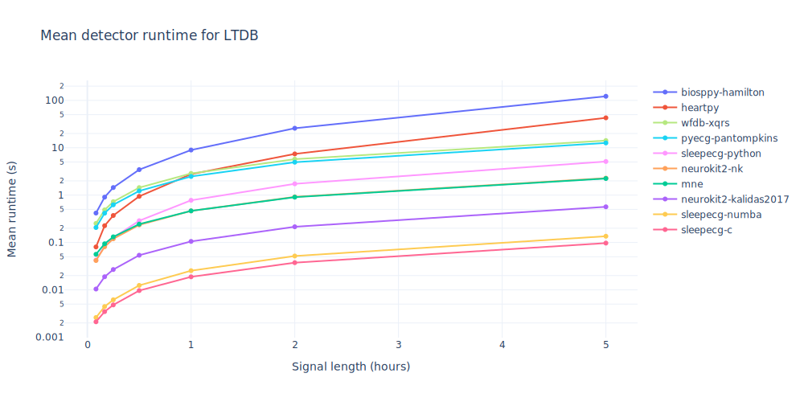

(heartbeat_detection)=
# Heartbeat detection
ECG-based sleep staging heavily relies on heartrate variability. Therefore, a reliable and efficient heartbeat detector is essential. SleepECG provides a detector based on the approach described by [Pan & Tompkins (1985)](https://doi.org/10.1109/TBME.1985.325532). We outsourced performance-critical code to a C extension, which makes the detector substantially faster than other implementations. However, we also provide Numba and pure Python backends (the Numba backend is almost as fast whereas the pure Python implementation is much slower).


## Usage
The function {func}`sleepecg.detect_heartbeats` finds heartbeats in an unfiltered ECG signal `ecg` with sampling frequency `fs` (in Hz). It returns the indices of all detected heartbeats. A complete example including visualization and performance evaluation is available in [`examples/heartbeat_detection.py`](https://github.com/cbrnr/sleepecg/blob/main/examples/heartbeat_detection.py).
```python
from sleepecg import detect_heartbeats

detection = detect_heartbeats(ecg, fs)
```

For best results, we recommend a sampling frequency of at least 100 Hz. The algorithm will return similar results regardless of the scaling of the data.

## Examples

Let's detect heartbeats in a 5 minute long electrocardiogram:

```python
from scipy.misc import electrocardiogram
from sleepecg import detect_heartbeats

ecg = electrocardiogram()  # 5 min of ECG data at 360 Hz
fs = 360
beats = detect_heartbeats(ecg, fs)
print(f"{len(beats)} heartbeats detected ({', '.join(beats[0:5])}, ...)")
# 478 heartbeats detected (125, 342, 551, 748, 944, ...)
```

Next, we can calculate the RR intervals in milliseconds:

```python
rri = 1000 * np.diff(beats) / fs
print(np.round(rri[:10]))  # show the first 10 RR intervals
# array([602, 580, 547, 544, 516, 516, 511, 527, 525, 513])
```

Now let's add some random noise to the electrocardiogram and compare the heartbeat detection with and without noise:

```python
import numpy as np
from sleepecg import compare_heartbeats

np.random.seed(42)
ecg_noisy = ecg + np.random.rand(ecg.size)
beats_noisy = detect_heartbeats(ecg_noisy, fs)
# tp = true positive, fp = false positive, fn = false negative
tp, fp, fn = compare_heartbeats(beats_noisy, beats)
print(f"{len(tp)} TP, {len(fp)} FP, {len(fn)} FN")
# 305 TP, 201 FP, 173 FN
```

## Benchmarks
All code used for performance evaluation is available in [`examples/benchmark/`](https://github.com/cbrnr/sleepecg/tree/main/examples/benchmark). The used package versions are listed in [`requirements-benchmark.txt`](https://github.com/cbrnr/sleepecg/blob/main/examples/benchmark/requirements-benchmark.txt).

We evaluated detector runtime using slices of different lengths from [LTDB](https://physionet.org/content/ltdb/1.0.0/) records with at least 20 hours duration. Error bars in the plot below correspond to the standard error of the mean. The C backend of our detector is by far the fastest implementation among all tested packages (note that the *y*-axis is logarithmically scaled). Runtime evaluation was performed on an [Intel® Xeon® Prozessor E5-2440 v2](https://ark.intel.com/content/www/us/en/ark/products/75263/intel-xeon-processor-e5-2440-v2-20m-cache-1-90-ghz.html) with 32 GiB RAM. No parallelization was used.



We also evaluated detection performance on all [MITDB](https://physionet.org/content/mitdb/1.0.0/) records. We defined a successful detection if it was within 100 ms (36 samples) of the corresponding annotation (using a tolerance here is necessary because annotations usually do not coincide with the exact R peak locations). In terms of recall, precision, and F1 score, our detector is among the best heartbeat detectors available.


For analysis of heartrate variability, detecting the exact location of heartbeats is essential. As a measure of how accurate a detector is, we computed Pearson's correlation coefficient between resampled RRI time series deduced from annotated and detected beat locations from all [GUDB](https://github.com/berndporr/ECG-GUDB) records. Our implementation detects peaks in the bandpass-filtered ECG signal, so it produces stable RRI time series without any post-processing.


