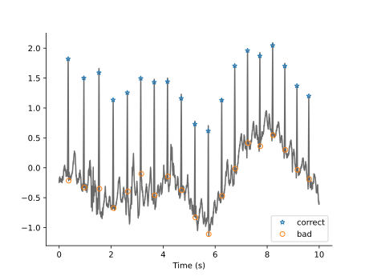
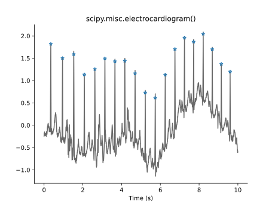

# Plotting
If [Matplotlib](https://matplotlib.org/) is installed, SleepECG can create useful plots related to various stages of the processing pipeline.

## ECG time course
The function [`sleepecg.plot_ecg()`][sleepecg.plot_ecg] plots the time course of an ECG signal, optionally with one or more markers (such as detected heart beats). The following example demonstrates this functionality with toy data:

```python
import sleepecg

ecg, fs = sleepecg.get_toy_ecg()  # 5 min of ECG data at 360 Hz
beats = sleepecg.detect_heartbeats(ecg[:10 * fs], fs)

sleepecg.plot_ecg(ecg, fs, correct=beats, bad=beats + 7)
```



In this example, we plotted two different annotations, `beats` (the detected heartbeats) and `beats + 7` (detected heartbeats shifted by seven samples). Multiple annotations are automatically drawn with different colors and marker styles, and a legend disambiguates the various annotations.

Similarly, a [`sleepecg.ECGRecord`][sleepecg.ECGRecord] can be visualized with its [`sleepecg.ECGRecord.plot()`][sleepecg.ECGRecord.plot] method:

```python
import sleepecg

ecg, fs = sleepecg.get_toy_ecg()  # 5 min of ECG data at 360 Hz
beats = sleepecg.detect_heartbeats(ecg, fs)

record = sleepecg.ECGRecord(
    ecg,
    fs,
    beats,
    id="scipy.misc.electrocardiogram()",
)

record.plot()
```

This results in a similar plot, this time with only one type of annotation (which is contained in the record). By passing additional annotations as arguments, more annotations can be plotted as well.



## Hypnogram
A hypnogram shows annotated and/or predicted sleep stages over time. The following example demonstrates how to create this visualization:

```python
import sleepecg

record = next(sleepecg.read_slpdb("*41*"))
sleepecg.plot_hypnogram(
    record,
    record.sleep_stages,
    "wake-rem-n1-n2-n3",
    show_bpm=True,
)
```


Note that we cheated in this example, because we used the annotated sleep stages as our predictions, which results in two identical hypnograms (upper and middle panels). The heart rate in the lower panel is useful to detect segments with bad signal quality.
