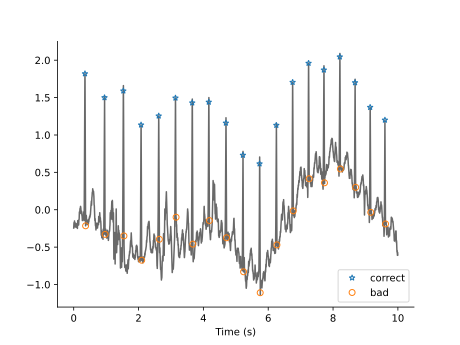
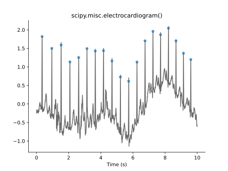

(plotting)=
# Plotting
If [Matplotlib](https://matplotlib.org/) is installed, SleepECG can create useful plots related to various stages of the processing pipeline.

## ECG time course
The function {func}`sleepecg.plot_ecg` plots the time course of an ECG signal, optionally with one or more markers (such as detected heart beats). The following example demonstrates this functionality with toy data:

```python
from scipy.misc import electrocardiogram
import sleepecg

ecg, fs = electrocardiogram(), 360
beats = sleepecg.detect_heartbeats(ecg, fs)

sleepecg.plot_ecg(ecg, fs, beats, beats + 7)
```



In this example, we plot two different annotations, `beats` (the detected heartbeats) and `beats + 7` (detected heartbeats shifted by seven samples). The different annotations are automatically drawn with different colors and marker styles (green asterisks correspond to `beats` and red circles correspond to `beats + 7`).

If an ECG record is available as a {class}`sleepecg.io.ECGRecord`, it can be visualized with the {meth}`sleepecg.io.ECGRecord.plot` method:

```python
from scipy.misc import electrocardiogram
import sleepecg
from sleepecg.io import ECGRecord

ecg, fs = electrocardiogram(), 360
beats = sleepecg.detect_heartbeats(ecg, fs)

record = ECGRecord(ecg, fs, beats, id="scipy.misc.electrocardiogram()")

record.plot()
```

This results in a similar plot, this time with only one type of annotation (which is contained in the record). By passing additional annotations as arguments, more annotations can be plotted as well.


